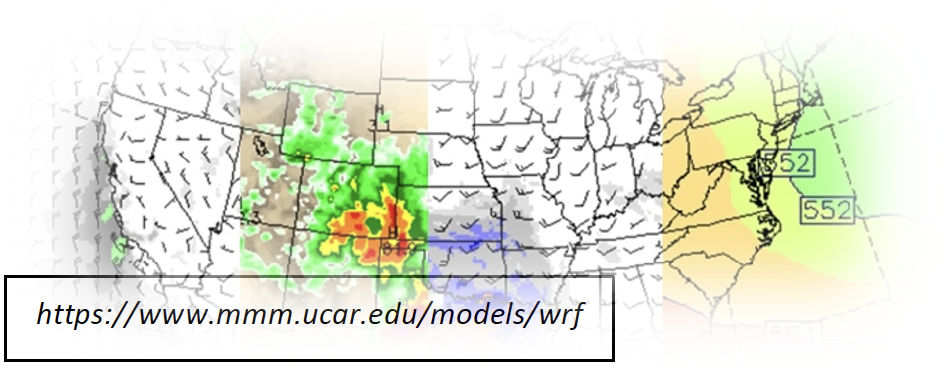

## Welcome

Welcome to **Weather Simulation and Prediction with Cloud Computing,** co-taught by Professors Andrea Orton and Wen-wen Tung.

This course will take place **virtually** from **Mar 27** to **Apr 29, 2023.** The main course site is at [Purdue Brightspace](http://purdue.brightspace.com), accessible to registered students.

## About

**Who needs to know how to simulate or predict the weather?**

Think about the following:

-   The droughts affected food shortages that preceded the 'Arab Spring' in 2010--2011, while the 2011 Floods in Thailand crippled global computer supply chains for hard disc drives.

-   The August 2020 Midwest derecho as powerful as a major hurricane caused wide-scale utility disruptions and over \$11 billions in damages. Weather impacts deliver various levels of complexity for decision-makers.

In the big picture, the weather and a changing climate widely affect the attainment of the 17 Sustainable Development Goals (SDGs) of United Nations' 2030 Agenda for Sustainable Development that aims at a sustainable future for "people, planet and prosperity".

This experiential-learning course teaches Numerical Weather Prediction (NWP), the science of predicting weather based on weather observations using mathematical models that describe atmospheric physical and dynamic processes. Students will learn to simulate and predict weather on high-performance computers and cloud computing services. Using historical severe weather cases, students will learn the processes of the atmosphere and physical Earth that are represented within NWP as well as the outcomes of these events that NWP can capture. The course's capstone will be for students to synthesize the NWP technology with societal impacts relevant toward their field of study by re-enacting and analyzing a historical weather event.

The course learning outcomes are:

1.  Explain NWP and its components

2.  Effectively run a NWP model on supercomputer and cloud computational resources to produce forecasts

3.  Articulate real-world application by connecting the science with technology through an end of module project simulating a historical event and discussing the societal impacts

## What to expect

-   During the course, the participants will have access to cloud environments in NSF Access Anvil through an OnDemand interface, provided through Purdue Rosen Center for Advanced Computing.
-   Participants will be guided on how to log into the cloud environment, import needed data recipes and resources, and will have the opportunity to explore and develop science and applications workflows in a cloud environment (hosted in Anvil) using example tutorials as building blocks.
-   The examples and assignments use publicly available data and resources. Participants will strengthen their practice of open science using open source code.
-   Reproducibility.

In the two to three weeks leading up to the course, participants are encouraged to review **background resources** that will facilitate a more effective learning experience.

**The following datasets are currently available:**

## Code of Conduct

The course is a safe learning space and all participants are required to abide by our [Code of Conduct](https://openscapes.org/code-of-conduct).

## Acknowledgements

We thank all of the additional RCAC staff that have have joined as helpers.

This hackathon book is made with [quarto](https://quarto.org). See the [earthdata-cloud-cookbook](https://nasa-openscapes.github.io/earthdata-cloud-cookbook/contributing/) to learn more about how we work and contributing.
